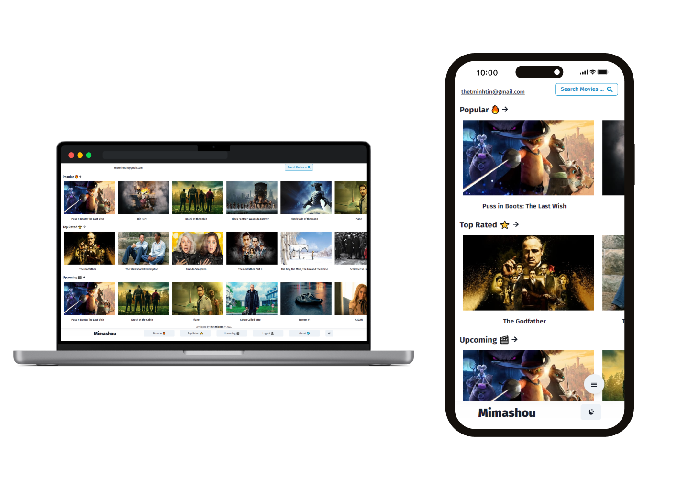

# mimashou-101.
A movie storing web app which can save your favourite or watch later movies on firebase cloud storage with your own account.

# Major Technologies
- ### [ReactJS](https://beta.reactjs.org/)
- ### [Firebase](https://firebase.google.com/)
- ### [The Movie Database](https://www.themoviedb.org/)
- ### [useContext](https://beta.reactjs.org/reference/react/useContext)
- ### [ChakraUI](https://chakra-ui.com/)

# Preview Pages
**Mockup**

***Live Demo*** - https://mimashou-101.vercel.app/

## Installation in local

### `npm install`

Installs the required packages by NodeJS.

### `npm start`

Runs the app in the development mode.\
Open [http://localhost:3000](http://localhost:3000) to view it in your browser.
